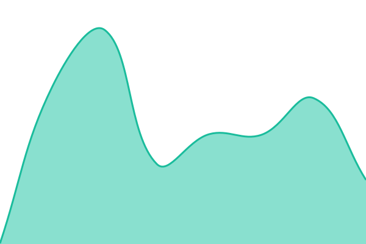
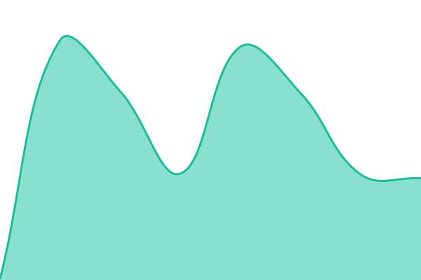

# [📈 Live Status](https://Flipper-Ecosystem.github.io/perps-status): <!--live status--> **🟧 Partial outage**

This repository contains the open-source uptime monitor and status page for [Flipper](https://flpp.io), powered by [Upptime](https://github.com/upptime/upptime).

With [Upptime](https://upptime.js.org), you can get your own unlimited and free uptime monitor and status page, powered entirely by a GitHub repository. We use [Issues](https://github.com/Flipper-Ecosystem/perps-status/issues) as incident reports, [Actions](https://github.com/Flipper-Ecosystem/perps-status/actions) as uptime monitors, and [Pages](https://Flipper-Ecosystem.github.io/perps-status) for the status page.

<!--start: status pages-->
<!-- This summary is generated by Upptime (https://github.com/upptime/upptime) -->
<!-- Do not edit this manually, your changes will be overwritten -->
<!-- prettier-ignore -->
| URL | Status | History | Response Time | Uptime |
| --- | ------ | ------- | ------------- | ------ |
|  [Platform overall](https://perps-api-sandbox.flpp.io/health/public) | 🟥 Down | [platform-overall.yml](https://github.com/Flipper-Ecosystem/perps-status/commits/HEAD/history/platform-overall.yml) | 

 450ms
     
 | 

<a href="https://status.flpp.io/history/platform-overall">100.00%</a>
    

|  [Trading API](https://perps-api-sandbox.flpp.io/health/public) | 🟩 Up | [trading-api.yml](https://github.com/Flipper-Ecosystem/perps-status/commits/HEAD/history/trading-api.yml) | 

 783ms
     
 | 

<a href="https://status.flpp.io/history/trading-api">100.00%</a>
    

|  [Price Oracle](https://perps-api-sandbox.flpp.io/health/public) | 🟥 Down | [price-oracle.yml](https://github.com/Flipper-Ecosystem/perps-status/commits/HEAD/history/price-oracle.yml) | 

 619ms
     
 | 

<a href="https://status.flpp.io/history/price-oracle">100.00%</a>
    

|  [Blockchain Devnet](https://perps-api-sandbox.flpp.io/health/public) | 🟩 Up | [blockchain-devnet.yml](https://github.com/Flipper-Ecosystem/perps-status/commits/HEAD/history/blockchain-devnet.yml) | 

 519ms
     
 | 

<a href="https://status.flpp.io/history/blockchain-devnet">100.00%</a>
    

|  [DEX Routing](https://perps-api-sandbox.flpp.io/health/public) | 🟥 Down | [dex-routing.yml](https://github.com/Flipper-Ecosystem/perps-status/commits/HEAD/history/dex-routing.yml) | 

 387ms
     
 | 

<a href="https://status.flpp.io/history/dex-routing">100.00%</a>
    

|  [Order Execution](https://perps-api-sandbox.flpp.io/health/public) | 🟩 Up | [order-execution.yml](https://github.com/Flipper-Ecosystem/perps-status/commits/HEAD/history/order-execution.yml) | 

 1141ms
     
 | 

<a href="https://status.flpp.io/history/order-execution">100.00%</a>
    

|  [Indexer](https://perps-api-sandbox.flpp.io/health/public) | 🟩 Up | [indexer.yml](https://github.com/Flipper-Ecosystem/perps-status/commits/HEAD/history/indexer.yml) | 

 472ms
     
 | 

<a href="https://status.flpp.io/history/indexer">100.00%</a>
    

|  [Web App](https://perps-sandbox.flpp.io/perps) | 🟩 Up | [web-app.yml](https://github.com/Flipper-Ecosystem/perps-status/commits/HEAD/history/web-app.yml) | 

 181ms
     
 | 

<a href="https://status.flpp.io/history/web-app">100.00%</a>
    

<!--end: status pages-->

[**Visit our status website →**](https://Flipper-Ecosystem.github.io/perps-status)

## 📄 License

- Powered by: [Upptime](https://github.com/upptime/upptime)
- Code: [MIT](./LICENSE) © [Anand Chowdhary](https://anandchowdhary.com)
- Data in the `./history` directory: [Open Database License](https://opendatacommons.org/licenses/odbl/1-0/)
